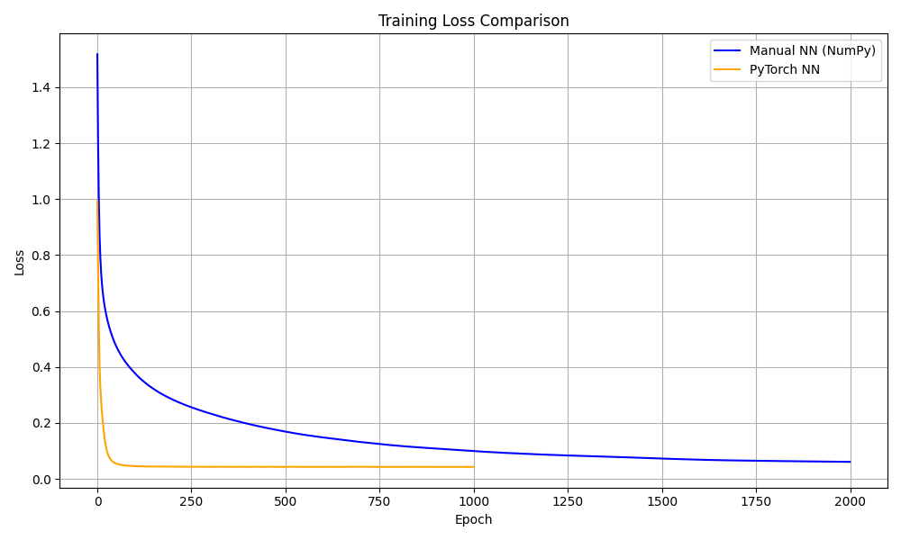
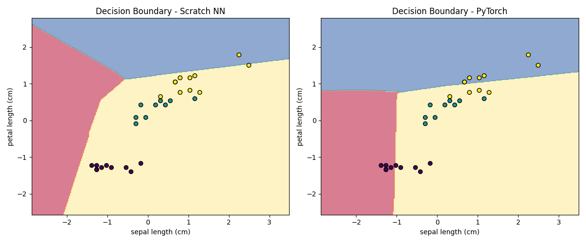

# 🌼 Iris Neural Network: From Scratch vs. PyTorch

This project showcases how to build a neural network **from scratch using NumPy** and compare it with an equivalent model implemented using **PyTorch**. The focus is on **learning**, **understanding**, and **visualizing** how neural networks learn to classify real-world data.

I used the Iris dataset, which is a classic multi-class classification problem involving three flower species.

---

## 📚 Overview

- 🧠 Manual Neural Network built with NumPy
- ⚙️ Equivalent model built using PyTorch
- 📉 Loss curves for both models
- 🎯 Prediction visualization and comparison
- 🌈 Decision boundary plot to show model behavior

---

## 🗂️ Project Structure

├── iris_nn.py # NumPy implementation
├── iris_nn_pytorch.py # PyTorch implementation
├── plot_decision_boundaries.py # For visualization
├── iris_nn_comparisonIris Neural Metwork From Scratch to PyTorch.ipynb # Jupyter notebook version
├── loss_manual.npy # Saved manual loss curve
├── loss_pytorch.npy # Saved PyTorch loss curve
├── plot_loses.png #  Combined loss plot
├── plot_des_bon.png # Decision boundary plot
├── scratch_predictions.npy # Predictions by manual model
├── pytorch_predictions.npy # Predictions by PyTorch model
├── torch_model.pth # Serialized PyTorch model state
└── README.md

---

## 🌸 The Iris Dataset

- **Features**:  
  - Sepal length  
  - Sepal width  
  - Petal length  
  - Petal width  
- **Classes**:  
  - Setosa  
  - Versicolor  
  - Virginica

---

## 🔧 Neural Network Architectures

### ✅ NumPy (From Scratch)
- 4 input neurons → 6 hidden (ReLU) → 3 output (Softmax)
- Manual implementation of forward/backward propagation
- Cross-entropy loss and basic gradient descent

### ⚡ PyTorch
- Same architecture using `torch.nn.Linear`
- Uses ReLU activations, softmax, and `torch.optim.Adam`
- Faster training and optimized performance

---

## 📈 Training Performance

### 🧪 Loss Curves



Both models successfully minimize the loss. PyTorch converges more quickly due to advanced optimizers, while the manual model shows a steady decline, proving the custom backpropagation logic works.

---

### 🧠 Decision Boundary



The decision boundary visualizes how each model separates classes using only two selected features. Both models show strong generalization and class separation.

---

## 🚀 Running the Project

### ✅ Dependencies

- Python 3.8+
- NumPy
- Matplotlib
- scikit-learn
- PyTorch
- Jupyter Notebook (optional)

### 🛠️ Setup

```bash
pip install numpy matplotlib scikit-learn torch notebook

```
#### ▶️ Steps

- Train the from-scratch model

```bash
python iris_nn.py

```
- Train the PyTorch model

```bash
python iris_nn_pytprch.py

```

- Generate plots

```bash 

python plot_decision_boundaries.py

```

- Explore in Jupyter Notebook

```bash 

jupyter notebook Iris Neural Network From Scratch to PyTorch.ipynb

```
---

## 💡 Key Learnings

- How neural networks work under the hood

- Manual backpropagation and gradient updates

- Benefits of using deep learning frameworks like PyTorch

- Visualizing predictions and decision boundaries

---

## 👤 Author

[M26I](https://github.com/M26I)
---
© 2025 M26I – For educational/portfolio use only.  
Unauthorized use or redistribution without credit is prohibited.
